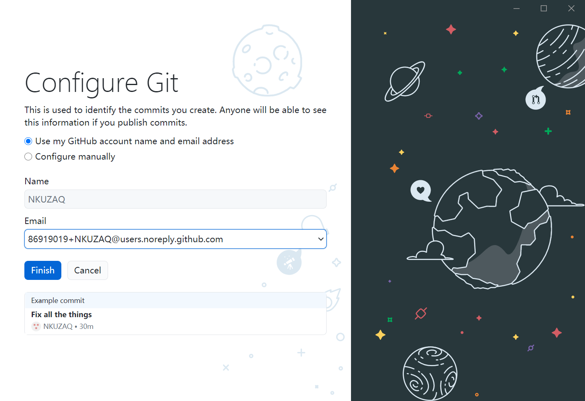

# week1

1. 名字：写的都队

2. 团队主页：以后再说

3. 代码版本控制：git

   ssh key: `16834/.ssh/id_rsa.pub`

   

   githubDesktop

   项目管理工具：飞书+QQ群

4. 需求文档

- 个人作业123
- 安装环境
- 挑一个模板
- 研究优秀作业（第一次ppt第4页
- 选题：奥运会&残奥会

- 设计表
- 爬数据
- 向助教确认细节
  - 模块图和流程图，数据库字典
  - 需求文档是什么
  - 到底要干什么

# week2

## 安装yii框架

# week3

## 挑选模板

https://www.51qianduan.com/temp/18715.html

## 数据库

### 1 Olympic history data zaq

https://www.kaggle.com/heesoo37/olympic-history-data-a-thorough-analysis/report

120年以来

- 运动员
  - 姓名、性别、年龄、身高、体重、国家、参加的场次
- 参赛国家

### 2 Summer medal zaq

https://www.kaggle.com/divyansh22/summer-olympics-medals?select=Summer-Olympic-medals-1976-to-2008.csv

1976到2008

举办的城市、年份、运动类型、项目大类、项目名称、运动员、性别、国家、奖牌

### 3 2016 Rio zaq

https://www.kaggle.com/rio2016/olympic-games

- 运动员
  - id、姓名、国籍、性别、生日、身高、体重、运动、金牌数、银牌数、铜牌数
- 国家
  - 国家、代码、人口、GDP
- 项目
  - id、运动种类、项目分类、项目名称、性别、场地

### 4 Sports and Medals zaq

https://www.kaggle.com/the-guardian/olympic-games

1896-2014

- 国家
  - 国家、国家代码、人口、GDP
- 夏季/冬季
  - 年份、城市、运动种类、运动类型、运动员、国家、性别、项目名称、奖牌

### 5 2021 tokyo country medal zaq

https://www.kaggle.com/stefanzivanov/olympic-games-2021-medals?select=Tokyo+2021+dataset+v4.csv

排名，队伍，金牌，银牌，铜牌，总数，州

